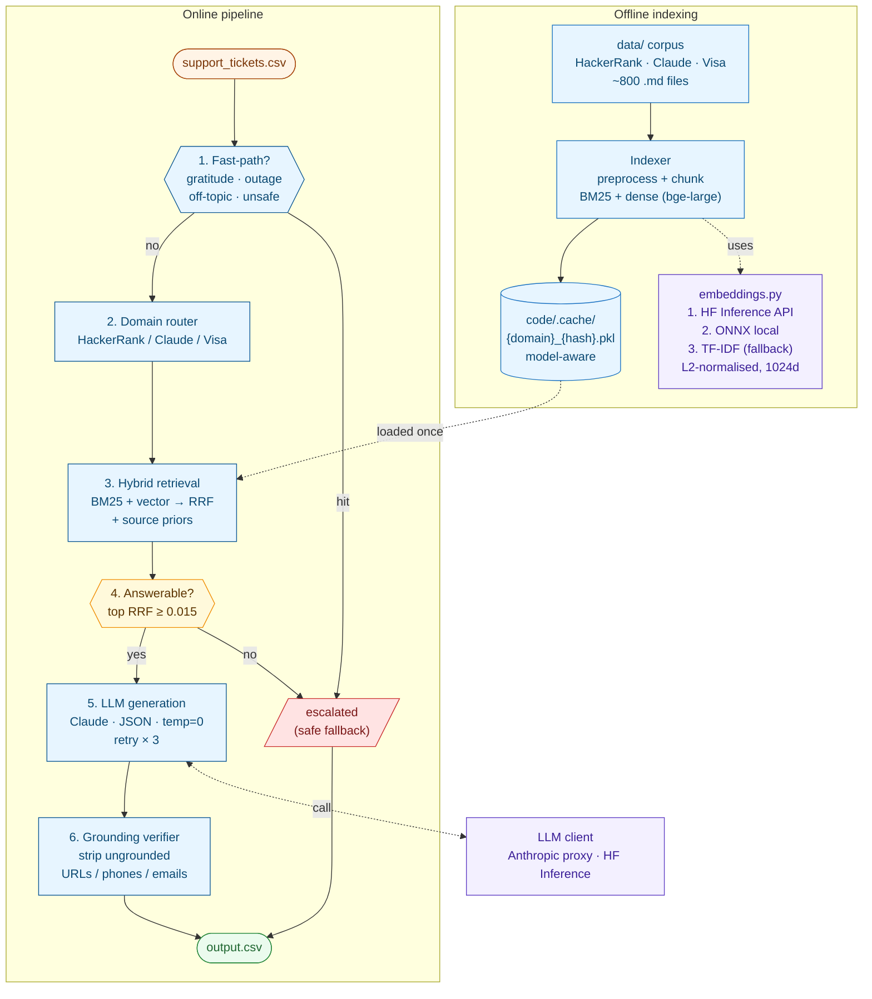

# HackerRank Orchestrate

Starter repository for the **HackerRank Orchestrate** 24-hour hackathon (May 1–2, 2026).

Build a terminal-based AI agent that triages real support tickets across three product ecosystems; **HackerRank**, **Claude**, and **Visa** — using only the support corpus shipped in this repo.

Read [`problem_statement.md`](./problem_statement.md) for the full task spec, input/output schema, and allowed values, and [`evalutation_criteria.md`](./evalutation_criteria.md) for how submissions are scored.

---

## Architecture



The agent runs in two phases. Offline indexing loads the local corpus, cleans and chunks each markdown doc by heading, then builds a per-domain BM25 + dense vector index (BAAI/bge-large-en-v1.5, 1024d) cached under `code/.cache/`. The online pipeline reads `support_tickets.csv`, applies fast-path rules (gratitude, outage, off-topic, malicious), routes to a domain (HackerRank / Claude / Visa), runs hybrid retrieval with reciprocal rank fusion + source priors, gates on answerability (top RRF score ≥ 0.015), then asks Claude (temperature 0, JSON, retry × 3) to produce a grounded response which is verified to strip ungrounded URLs/phones/emails before being written to `output.csv`. See [`code/README.md`](./code/README.md) for full module-level details.

---

## Contents

1. [Repository layout](#repository-layout)
2. [What you need to build](#what-you-need-to-build)
3. [Where your code goes](#where-your-code-goes)
4. [Quickstart](#quickstart)
5. [Chat transcript logging](#chat-transcript-logging)
6. [Submission](#submission)
7. [Judge interview](#judge-interview)
8. [Evaluation criteria](#evaluation-criteria)

---

## Repository layout

```
.
├── AGENTS.md                       # Rules for AI coding tools + transcript logging
├── problem_statement.md            # Full task description and I/O schema
├── README.md                       # You are here
├── code/                           # ← Build your agent here
│   └── main.py                     #   Entry point (rename/extend as you like)
├── data/                           # Local-only support corpus (no network needed)
│   ├── hackerrank/                 #   HackerRank help center
│   ├── claude/                     #   Claude Help Center export
│   └── visa/                       #   Visa consumer + small-business support
└── support_tickets/
    ├── sample_support_tickets.csv  # Inputs + expected outputs (for development)
    ├── support_tickets.csv         # Inputs only (run your agent on these)
    └── output.csv                  # Write your agent's predictions here
```

---

## What you need to build

A terminal-based agent that, for each row in `support_tickets/support_tickets.csv`, produces:

| Column         | Allowed values                                          |
| -------------- | ------------------------------------------------------- |
| `status`       | `replied`, `escalated`                                  |
| `product_area` | most relevant support category / domain area            |
| `response`     | user-facing answer grounded in the provided corpus      |
| `justification`| concise explanation of the routing/answering decision   |
| `request_type` | `product_issue`, `feature_request`, `bug`, `invalid`    |

Hard requirements (from `problem_statement.md`):

- Must be **terminal-based**.
- Must use **only the provided support corpus** (no live web calls for ground-truth answers).
- Must **escalate** high-risk, sensitive, or unsupported cases instead of guessing.
- Must avoid hallucinated policies or unsupported claims.

Beyond that you are free to bring your own approach — RAG, vector DBs, tool use, structured output, agent frameworks, classical ML, or anything else.

---

## Where your code goes

All of your work belongs in [`code/`](./code/). The repo ships with an empty `code/main.py` you can grow into your full agent — add more modules (`agent.py`, `retriever.py`, `classifier.py`, etc.) next to it as needed.

Conventions:

- Put a **README inside `code/`** describing how to install dependencies and run your agent.
- Read secrets **from environment variables only** (`OPENAI_API_KEY`, `ANTHROPIC_API_KEY`, …). Copy `.env.example` → `.env` (already gitignored) if you keep one. **Never hardcode keys.**
- Be **deterministic** where possible. Seed any random sampling.
- Write responses to `support_tickets/output.csv`.

---

## Quickstart

Clone this repository:

```bash
git clone git@github.com:interviewstreet/hackerrank-orchestrate-may26.git
cd hackerrank-orchestrate-may26
```

You are free to use any language or runtime. We recommend **Python**, **JavaScript**, or **TypeScript**.

---

## Chat transcript logging

This repo ships with an `AGENTS.md` that any modern AI coding tool (Cursor, Claude Code, Codex, Gemini CLI, Copilot, etc.) will read. It instructs the tool to append every conversation turn to a single shared log file:

| Platform       | Path                                              |
| -------------- | ------------------------------------------------- |
| macOS / Linux  | `$HOME/hackerrank_orchestrate/log.txt`            |
| Windows        | `%USERPROFILE%\hackerrank_orchestrate\log.txt`    |

You don't need to do anything to enable it — just use your AI tool normally. You'll upload this `log.txt` as your chat transcript at submission time.

---

## Submission

Submit on the HackerRank Community Platform:
<https://www.hackerrank.com/contests/hackerrank-orchestrate-may26/challenges/support-agent/submission>

You will upload **three** files:

1. **Code zip** — zip your `code/` directory and upload it. Exclude virtualenvs, `node_modules`, build artifacts, the `data/` corpus, and the `support_tickets/` CSVs.
2. **Predictions CSV** — your agent's output for `support_tickets/support_tickets.csv` (i.e. the populated `output.csv`).
3. **Chat transcript** — the `log.txt` from the path in [Chat transcript logging](#chat-transcript-logging).

---

## Judge interview

After a successful submission, your AI Judge interview will happen within a few hours after the hackathon ends. It will stay open for the next 4 hours. 

The AI Judge will have access to your submission and may ask about your approach, decisions, and how you used AI while building your solution. The interview will be 30 minutes long, and keeping your camera on is mandatory.

Results will be announced on May 15, 2026

---

## Evaluation criteria

Submissions are scored across four dimensions: agent design (your `code/`), the AI Judge interview, output accuracy on `support_tickets/output.csv`, and AI fluency from your chat transcript.

See [`evalutation_criteria.md`](./evalutation_criteria.md) for the full rubric.
