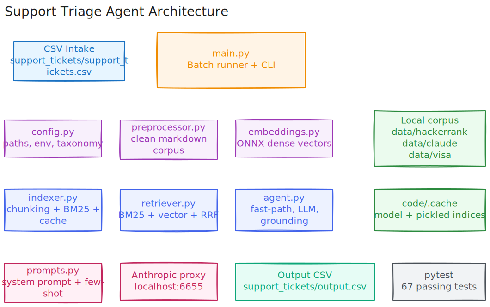

# Support Triage Agent

Python support triage agent for the HackerRank Orchestrate challenge.

## What It Does

- Reads support tickets from `support_tickets/support_tickets.csv`
- Retrieves evidence only from `data/`
- Classifies each ticket and drafts a grounded response
- Writes `support_tickets/output.csv` with the required schema

## Architecture



- Pipeline: CSV intake -> setup/config -> corpus cleanup -> embedding + indexing -> hybrid retrieval -> prompt + LLM response -> grounding verification -> output CSV
- `config.py`: paths, constants, taxonomy, env loading
- `preprocessor.py`: markdown cleanup for HackerRank, Claude, and Visa docs
- `embeddings.py`: HF Inference API embedder (preferred), ONNX local fallback, TF-IDF last resort
- `llm.py`: unified LLM client wrapping Anthropic + HuggingFace Inference API
- `indexer.py`: document loading, heading-based chunking, BM25/vector index build, model-aware cache
- `retriever.py`: hybrid retrieval with BM25, dense search, and RRF fusion
- `prompts.py`: system prompt, few-shot examples, prompt assembly
- `agent.py`: fast-path rules, LLM generation, grounding checks, ticket orchestration
- `main.py`: CLI entry point for batch CSV processing

## Requirements

- Python 3.14+
- Access to the local Anthropic-compatible proxy at `ANTHROPIC_BASE_URL`
- `ANTHROPIC_API_KEY` or `HAI_API_KEY` in `code/.env` or repo-root `.env`
- Optional `HG_TOKEN` for Hugging Face downloads

Install dependencies:

```bash
pip install -r code/requirements.txt
```

## Environment

Create `code/.env` with:

```env
ANTHROPIC_API_KEY=your_api_key_here
HAI_API_KEY=your_api_key_here
HG_TOKEN=your_huggingface_token_here
ANTHROPIC_BASE_URL=http://localhost:6655/anthropic/v1
```

The code normalizes the Anthropic base URL for the SDK automatically.

## Run

From the repository root:

```bash
python code/main.py --input support_tickets/support_tickets.csv --output support_tickets/output.csv
```

Optional:

```bash
python code/main.py --rebuild-index
```

## Output Schema

The generated CSV contains:

- `issue`
- `subject`
- `company`
- `response`
- `product_area`
- `status`
- `request_type`
- `justification`

## Retrieval And Determinism

- Retrieval is limited to the local `data/` corpus
- Dense embeddings use `BAAI/bge-large-en-v1.5` (1024d) via HF Inference API, with ONNX and TF-IDF fallbacks
- Hybrid ranking combines BM25 and vector similarity with reciprocal rank fusion
- Cached indices are stored under `code/.cache/` (gitignored, auto-rebuilt on first run)
- Cache keys include a model hash so they auto-invalidate when the embedding model changes
- LLM calls use `temperature=0`
- Dependencies are pinned in `requirements.txt`

## Tests

Run from the repository root:

```bash
python -m pytest code/tests -q
```

The suite includes:

- unit tests for config, preprocessing, embeddings, indexing, retrieval, prompts, and agent logic
- integration tests that exercise the real end-to-end pipeline

## Submission Zip

The `code/.cache/` directory (~160 MB of pickle indices) is gitignored and must be excluded
from the zip. It is auto-rebuilt on first run. Use `git archive` to create a clean zip (~2.5 MB):

```bash
git archive --format=zip --output=submission.zip HEAD
```

This respects `.gitignore` and excludes `.cache/`, `__pycache__/`, `.env`, etc.
